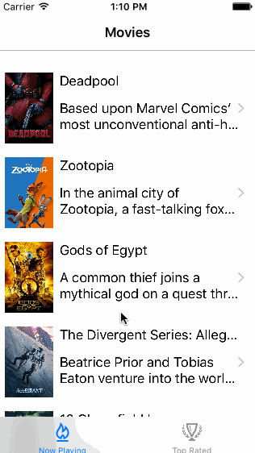

# Project 1 - Flicks

Flicks is a movies app using the [AFNetworking](http://docs.themoviedb.apiary.io/#).

Time spent: 20 hours spent in total

Completed user stories:

 * [x] Required: User can view a list of movies currently playing in theaters from The Movie Database. Poster images must be loaded asynchronously.
 * [x] Required: User can view movie details by tapping on a cell.
 * [x] Required: User sees loading state while waiting for movies API. You can use one of the 3rd party libraries listed on CocoaControls.
* [x] Required: User sees an error message when there's a networking error. You may not use UIAlertController or a 3rd party library to display the error. (Checked with Chau, but it is not showing in my laptop. hopfully it works..)
 * [x] Required: User can pull to refresh the movie list.

 * [x] Optional: a tab bar for Now Playing or Top Rated movies.

Walkthrough of all user stories:

GIF created with [LiceCap](http://www.cockos.com/licecap/).

Copyright [2016] [Kunho Kim]

Licensed under the Apache License, Version 2.0 (the "License");
you may not use this file except in compliance with the License.
You may obtain a copy of the License at

http://www.apache.org/licenses/LICENSE-2.0

Unless required by applicable law or agreed to in writing, software
distributed under the License is distributed on an "AS IS" BASIS,
WITHOUT WARRANTIES OR CONDITIONS OF ANY KIND, either express or implied.
See the License for the specific language governing permissions and
limitations under the License.